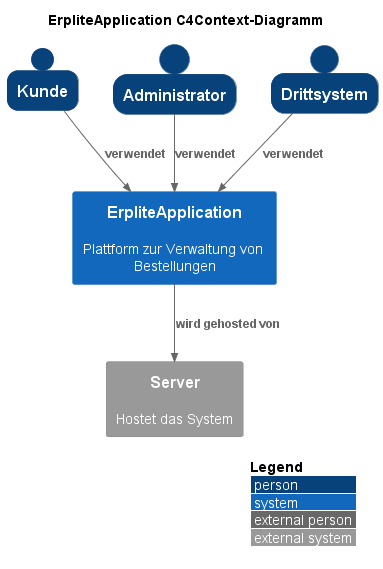
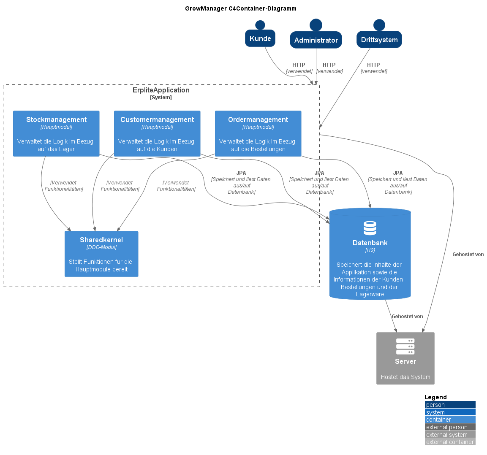
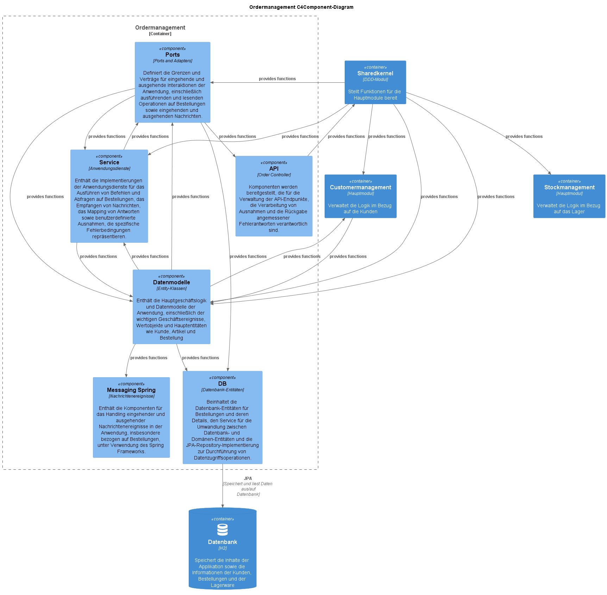

# Aufgabe Makroarchitektur Teil 1 (Modulith + Theorie)

## Theorie: Recherchiere zu folgenden Fragestellungen und fasse deine Erkenntnisse übersichtlich und illustrativ zusammen!

1. Was ist Sofwarearchitektur?
    Softwarearchitektur bezeichnet die grundlegende Struktur einer Software, einschließlich der Art und Weise, wie diese Struktur ihre Verhaltensaspekte behandelt. Sie umfasst die Funktionen und Eigenschaften, die nützlich sind, wenn das Softwareprodukt ein System bildet oder ein Systemteil ist. Es handelt sich dabei um die Definition der Systemkomponenten, ihrer externen Eigenschaften und ihrer Beziehungen zueinander und zur Umgebung.
    Die Softwarearchitektur ist entscheidend für das Verständnis, wie ein System oder eine Softwareanwendung funktioniert. Sie bietet einen Plan und ein koordiniertes Regelwerk, das dazu beiträgt, die Komplexität eines Systems zu bewältigen. Hierbei handelt es sich um Regeln, die bei der Konstruktion des Systems helfen, etwa um Standards und Richtlinien.
    Im Allgemeinen kann die Softwarearchitektur verschiedene Sichten oder Perspektiven umfassen, darunter:

    - Strukturansicht: Wie ist die Software in Module oder Komponenten unterteilt und wie interagieren diese miteinander?

    - Verhaltensansicht: Wie verhalten sich die einzelnen Komponenten und das Gesamtsystem in Bezug auf bestimmte Eingaben oder Ereignisse?

    - Praktische Ansicht: Wie wird die Software in der realen Welt eingesetzt, wie kann sie gewartet und erweitert werden, und welche nicht-funktionalen Anforderungen (z. B. Leistung, Sicherheit, Zuverlässigkeit) muss sie erfüllen?

    Die Softwarearchitektur dient auch als Kommunikationsmittel zwischen den verschiedenen Stakeholdern (wie Entwicklern, Projektmanagern, Kunden usw.), da sie einen gemeinsamen Rahmen für das Verständnis der wichtigsten Designentscheidungen bietet. Sie unterstützt zudem die Planung und Abstimmung von Aufgaben während des gesamten Softwareentwicklungslebenszyklus.

2. Wie kann man Softwarearchitektur dokumentieren?
    Die Dokumentation der Softwarearchitektur ist ein wichtiger Teil des Entwicklungsprozesses. Sie dient als Leitfaden für das Entwicklerteam und ermöglicht eine bessere Kommunikation mit Stakeholdern. Sie kann auch dazu beitragen, die Qualität der Software zu verbessern und die Wartung zu erleichtern. Es gibt verschiedene Ansätze zur Dokumentation der Softwarearchitektur, aber hier sind einige grundlegende Schritte und Methoden, die oft verwendet werden:

    - Architekturbeschreibung: Der erste Schritt besteht darin, eine Übersicht über die Architektur zu erstellen. Dies sollte eine klare und prägnante Beschreibung der Gesamtstruktur und der einzelnen Komponenten umfassen, einschließlich ihrer Beziehungen zueinander und zur externen Umgebung.

    - Diagramme: Visuelle Darstellungen können oft hilfreich sein, um die Struktur und das Verhalten der Software zu veranschaulichen. Dazu können UML-Diagramme (Unified Modeling Language) wie Klassendiagramme, Sequenzdiagramme und Zustandsdiagramme gehören.

    - Technische Details: Detaillierte Informationen über die einzelnen Komponenten und ihre Beziehungen können ebenfalls hilfreich sein. Dies kann die Spezifikationen der Komponenten, die verwendeten Technologien und Plattformen, Datenstrukturen, Algorithmen und mehr umfassen.

    - Nicht-funktionale Anforderungen: Diese sollten ebenfalls dokumentiert werden, einschließlich der Leistungs-, Sicherheits-, Zuverlässigkeits- und anderen Anforderungen, die die Software erfüllen muss.

    - Entwurfsentscheidungen: Dokumentieren Sie die Gründe für bestimmte Entwurfsentscheidungen. Dies kann helfen, zukünftige Entscheidungen zu informieren und bietet einen Einblick in den Prozess der Softwareentwicklung.

    - Richtlinien zur Wartung und Erweiterung: Diese können dazu beitragen, die langfristige Wartung und Erweiterung der Software zu erleichtern.

    Es gibt auch verschiedene Standards und Rahmenwerke zur Dokumentation der Softwarearchitektur, wie das ISO/IEC/IEEE 42010:2011, das eine Anleitung zur Dokumentation der Softwarearchitektur bietet, und das "4+1" Architekturmodell, das einen Ansatz zur Darstellung von Architekturen unter Verwendung von mehreren, miteinander verbundenen Sichten bietet.

3. Welches sind die wichtigsten Eigenschaften von Langlebigen Softwarearchitekturen (Lilienthal)?
    Carola Lilienthal ist eine anerkannte Expertin auf dem Gebiet der Softwarearchitektur, insbesondere in Bezug auf langlebige Softwarearchitekturen und das Management technischer Schulden. In ihrem Buch "Langlebige Software-Architekturen: Technische Schulden analysieren, begrenzen und abbauen" betont sie mehrere Schlüsseleigenschaften und Praktiken, die dazu beitragen, die Lebensdauer einer Softwarearchitektur zu verlängern:

    - Verständlichkeit: Die Architektur sollte leicht zu verstehen und klar dargestellt sein, damit Entwickler sie effizienter warten und erweitern können.

    - Konsistenz: Eine einheitliche und konsistente Architektur hilft dabei, Fehler zu reduzieren und das Verständnis des Systems zu erleichtern.

    - Nachvollziehbarkeit: Entscheidungen, die die Architektur beeinflussen, sollten gut dokumentiert und begründet sein. Dies erleichtert zukünftige Wartungs- und Weiterentwicklungsaufgaben.

    - Robustheit: Eine robuste Architektur sollte in der Lage sein, Änderungen in den Anforderungen oder der Umgebung zu bewältigen, ohne dass umfangreiche Umstrukturierungen oder Umbauten erforderlich sind.

    - Minimierung technischer Schulden: Technische Schulden sollten so weit wie möglich minimiert werden. Dies beinhaltet die bewusste Anerkennung und Überwachung solcher Schulden und die Anstrengung, sie im Laufe der Zeit abzubauen.

    - Fokus auf Qualität: Die Architektur sollte Qualitätsanforderungen wie Leistung, Sicherheit und Zuverlässigkeit von Anfang an berücksichtigen und diese nicht als nachträgliche Überlegung behandeln.

    - Evolutionäre Entwicklung: Die Architektur sollte flexibel genug sein, um sich mit der Zeit weiterzuentwickeln und sich an verändernde Anforderungen anzupassen.

    Diese Merkmale tragen dazu bei, dass die Softwarearchitektur langlebig ist, also eine hohe Lebensdauer und Anpassungsfähigkeit hat. Die Idee ist, eine Balance zwischen den aktuellen Anforderungen und der langfristigen Wartbarkeit und Erweiterbarkeit der Software zu finden.

4. Was ist ein Modulith?
    Der Begriff "Modulith" wurde von Oliver Drotbohm geprägt und wird verwendet, um eine bestimmte Art von Softwarearchitektur zu beschreiben. Ein Modulith ist ein monolithisches System, das aber intern so strukturiert ist, dass es modulare Eigenschaften aufweist. Das heißt, es ist in eigenständige Module unterteilt, die jeweils eine bestimmte Aufgabe oder Funktion erfüllen.

    Jedes Modul eines Moduliths sollte so konzipiert sein, dass es unabhängig von den anderen funktionieren kann. Die Kommunikation zwischen den Modulen erfolgt über definierte Schnittstellen. Dies ermöglicht eine klare Trennung von Zuständigkeiten und verbessert die Übersichtlichkeit und Wartbarkeit des Systems.

    Ein Modulith ist somit ein Kompromiss zwischen einem Monolithen und einer Microservices-Architektur. Er bietet viele Vorteile der Microservices (wie die Modularität und die Isolierung der Komponenten) ohne einige der Herausforderungen, die mit der Verwaltung einer verteilten Architektur verbunden sind (wie Netzwerklatenz, Datenkohärenz und komplexe Service-Orchestrierung).

    Es ist wichtig zu beachten, dass ein Modulith nicht nur eine zufällige Sammlung von Modulen ist. Es erfordert eine sorgfältige Planung und Architektur, um sicherzustellen, dass jedes Modul effektiv isoliert ist und gleichzeitig effizient mit den anderen Modulen kommunizieren kann.

5. Wie funktioniert die Ports and Adapters Architektur?
    Die Ports and Adapters Architektur, auch bekannt als Hexagonal Architektur, wurde von Alistair Cockburn entwickelt. Sie zielt darauf ab, die Anwendung von den Details der Infrastruktur zu entkoppeln, um die Unabhängigkeit und Austauschbarkeit zu erhöhen.
    Hier ist eine vereinfachte Beschreibung davon, wie die Ports and Adapters Architektur funktioniert:

    - Die Anwendung im Zentrum (Hexagon): Die Geschäftslogik der Anwendung, auch als "Domain Model" bezeichnet, bildet das Zentrum der Architektur. Diese Kernkomponente ist unabhängig von den technologischen Details der Anwendung und sollte in einer idealen Welt ohne Kenntnis von Datenbanken, Benutzeroberflächen oder externen Systemen existieren können.

    - Ports: Ports repräsentieren die Schnittstellen, durch die die Anwendung mit der Außenwelt interagiert. Es gibt primäre Ports, die von der Anwendung selbst genutzt werden, um ihre Funktionalität zur Verfügung zu stellen (z.B. Services, die von einer Benutzeroberfläche genutzt werden), und sekundäre Ports, die von der Anwendung genutzt werden, um auf externe Ressourcen zuzugreifen (z.B. Datenbanken, Webdienste).

    - Adapters: Adapter sind Implementierungen, die zu einem Port passen und die Kommunikation zwischen der Anwendung und der Außenwelt ermöglichen. Sie übersetzen Anfragen und Daten zwischen den Formaten, die von der Anwendung und den externen Systemen verwendet werden. Zum Beispiel könnte ein Adapter eine Datenbankanfrage in einen Aufruf an die Geschäftslogik der Anwendung umwandeln.

    Der Hauptvorteil dieser Architektur besteht darin, dass sie die Anwendung von der Infrastruktur entkoppelt. Dies bedeutet, dass man Teile der Infrastruktur (wie Datenbanken oder Benutzeroberflächen) ändern oder austauschen kann, ohne die Kernlogik der Anwendung zu beeinflussen. Dies erhöht die Flexibilität und erleichtert das Testen der Anwendung.

6. DDD: Was sind die wesentlichen Bausteine des modellgetriebenen Entwurfs (Taktische Pattern) aus DDD?
    Beim Domain-Driven Design (DDD) gibt es eine Reihe von "taktischen Mustern" oder Bausteinen, die zur Implementierung des modellgetriebenen Entwurfs verwendet werden. Die folgenden sind die wichtigsten:

    - Entity (Entität): Eine Entität ist ein Objekt, das nicht nur durch seine Attribute, sondern vor allem durch eine Kontinuität und Identität über die Zeit und über verschiedene Darstellungen hinweg definiert ist. Ein Beispiel für eine Entität könnte ein bestimmter Benutzer in einem System sein.

    - Value Object (Wertobjekt): Ein Value Object ist ein Objekt, das Attribute hat, aber keine eindeutige Identität benötigt. Sie sind oft unveränderlich und können frei ersetzt und zwischen Objekten ausgetauscht werden. Beispiele sind Dinge wie Farben, Geldbeträge oder Adressen.

    - Aggregate: Ein Aggregate ist eine Ansammlung von Objekten, die als Einheit behandelt werden. Es gibt ein Wurzelobjekt (Aggregate Root), über das alle Interaktionen mit dem Aggregate laufen. Dieses Muster wird verwendet, um Konsistenzgrenzen zu gewährleisten und Datenintegrität zu sichern.

    - Domain Event (Domänenereignis): Ein Domain Event ist etwas, das in der Domäne passiert und von Bedeutung ist. Es wird oft verwendet, um zustandsändernde Ereignisse zu modellieren, die für das Geschäft relevant sind.

    - Service: Ein Service ist eine Operation, die nicht natürlich als Methode eines Value Objects oder einer Entität passt. Sie definieren Handlungen, die vom Modell ausgeführt werden können.

    - Repository: Ein Repository stellt eine Sammlung von Objekten zur Verfügung, die Sie speichern und abrufen können. Es stellt oft Methoden zur Verfügung, um Objekte basierend auf bestimmten Kriterien zu finden.

    - Factory: Eine Factory wird verwendet, um die Erstellung komplexer Objekte und Aggregate zu kapseln.

    Diese taktischen Muster sind Bestandteile eines größeren "strategischen Design", das auch Kontexte, Bounded Contexts, und die Beziehungen zwischen ihnen (Kontextzuordnung) beinhaltet. DDD ist ein mächtiges Werkzeug für das Modellieren komplexer Geschäftslogik und diese taktischen Muster sind die Bausteine, mit denen dieses Modell erstellt wird.

## Abgabe der Architekturanalyse des bestehenden erplite-Backends
1. Dokumentation (texthelle Beschreibung, Codeauszüge, C4-Diagramme, Klassendiagramme) der Ports-Und-Adapters-Architektur und der DDD-Bestandteile (taktische Muster) von Ordermanagement anhand der gegebenen Anwendungsfälle, die schon implementiert sind:
    - Bestellung aufgeben
    - Bestellung auf bezahlt setzen
    - Packliste generieren
    - Packlistenitems abhaken

Zunächst wird der Aufbau der Anwendung mit einem C4-Diagramm näher beschrieben:

Dieses C4-Context-Diagramm visualisiert das hochrangige System und seine Interaktionen mit den beteiligten Benutzern bzw. Akteuren.

- Im Mittelpunkt steht das System "ErpliteApplication", das als Plattform zur Verwaltung von Bestellungen dient. Es gibt drei Hauptakteure, die mit dem System interagieren:

- Der Kunde: Ein Endbenutzer, der das System verwendet, wahrscheinlich um Bestellungen zu tätigen oder zu verfolgen.

- Der Administrator: Eine Art interner Benutzer, der das System verwendet, möglicherweise um Bestellungen zu verwalten, Kundeninformationen zu verwalten oder Berichte zu erstellen.

- Das Drittsystem: Ein anderes System, das mit der "ErpliteApplication" interagiert. Dies könnte ein Zahlungssystem, ein Bestandsverwaltungssystem oder ein anderes System sein, das für die ordnungsgemäße Funktion des Hauptsystems notwendig ist.

Schließlich wird das System "ErpliteApplication" von einem Server gehostet, der im Diagramm als externes System dargestellt ist.

Dieses C4-Container-Diagramm stellt die Architektur der "ErpliteApplication" auf einer etwas detaillierteren Ebene dar, indem es die Hauptmodule oder "Container" innerhalb des Systems zeigt und wie sie miteinander interagieren.

Im System "ErpliteApplication" gibt es drei Hauptmodule:

- "Customermanagement": Dieses Modul verwaltet die Logik im Bezug auf die Kunden. Es könnte Funktionen wie das Hinzufügen neuer Kunden, die Aktualisierung von Kundendaten und die Verarbeitung von Kundenanfragen beinhalten.

- "Ordermanagement": Dieses Modul verwaltet die Logik im Bezug auf die Bestellungen. Es könnte Funktionen wie das Erstellen neuer Bestellungen, die Aktualisierung des Bestellstatus und die Verarbeitung von Bestellungsbezogenen Anfragen beinhalten.

- "Stockmanagement": Dieses Modul verwaltet die Logik im Bezug auf das Lager. Es könnte Funktionen wie das Hinzufügen neuer Lagerbestände, die Aktualisierung von Lagerbestandsdaten und die Verarbeitung von Lagerbezogenen Anfragen beinhalten.

Es gibt auch ein zusätzliches Modul namens "Sharedkernel", das als DDD (Domain Driven Design) Modul dient. Dieses Modul stellt Funktionen bereit, die von den drei Hauptmodulen verwendet werden.

Alle Module interagieren mit einer H2-Datenbank, die die Inhalte der Anwendung sowie die Informationen der Kunden, Bestellungen und der Lagerware speichert.

Sowohl die "ErpliteApplication" als auch die Datenbank werden von einem Server gehostet.

Drei Arten von Akteuren interagieren mit dem System: Der Kunde, der Administrator und das Drittsystem. Sie verwenden alle das HTTP-Protokoll, um mit der "ErpliteApplication" zu interagieren.

Das C4-Komponentendiagramm stellt das Ordermanagement-Modul in feiner Detailstufe dar, und zwar auf der Komponentenebene. Es beschreibt, wie verschiedene Komponenten innerhalb dieses Moduls miteinander interagieren und welche Funktionen sie bereitstellen.

- "API" oder "Order Controller": Diese Komponente ist verantwortlich für die Bereitstellung von API-Endpunkten, die Verarbeitung von Ausnahmen und die Rückgabe angemessener Fehlerantworten.

- "DB" oder "Datenbank-Entitäten": Diese Komponente umfasst die Datenbank-Entitäten für Bestellungen und deren Details. Sie beinhaltet auch einen Service für die Umwandlung zwischen Datenbank- und Domänen-Entitäten sowie eine JPA-Repository-Implementierung zur Durchführung von Datenzugriffsoperationen.

- "Service" oder "Anwendungsdienste": Diese Komponente beinhaltet die Implementierungen von Anwendungsdiensten für das Ausführen von Befehlen und Abfragen auf Bestellungen, das Empfangen von Nachrichten, das Mapping von Antworten und benutzerdefinierte Ausnahmen, die spezifische Fehlerbedingungen repräsentieren.

- "Datenmodelle" oder "Entity-Klassen": Diese Komponente enthält die Hauptgeschäftslogik und Datenmodelle der Anwendung, einschließlich wichtiger Geschäftsereignisse, Wertobjekte und Hauptentitäten wie Kunde, Artikel und Bestellung.

- "Ports" oder "Ports and Adapters": Diese Komponente definiert die Grenzen und Verträge für eingehende und ausgehende Interaktionen der Anwendung, einschließlich ausführender und lesender Operationen auf Bestellungen sowie eingehender und ausgehender Nachrichten.

- "Messaging Spring" oder "Nachrichtenereignisse": Diese Komponente ist verantwortlich für das Handling von eingehenden und ausgehenden Nachrichtenereignissen in der Anwendung, insbesondere bezogen auf Bestellungen, unter Verwendung des Spring Frameworks.

Alle diese Komponenten interagieren und arbeiten zusammen, um die Funktionalitäten des Ordermanagement-Moduls bereitzustellen.

Darüber hinaus interagiert das Ordermanagement-Modul auch mit dem "Sharedkernel"-Modul, dem "Stockmanagement"-Modul, dem "Customermanagement"-Modul und der "H2"-Datenbank, um die erforderlichen Daten abzurufen oder zu speichern.

Dieses  Klassendiagramm zeigt die Beziehungen zwischen verschiedenen Klassen im Kontext der API-Komponente des vorangegangenen Diagramms.

- ApiErrorResponse ist eine Klasse, die ein Error-Code- und Error-Message-Feld enthält. Diese Klasse wird in der Regel verwendet, um eine standardisierte Fehlerantwort für die API zu liefern.

- ApiValidationErrorResponse ist eine spezielle Art von Fehlerantwort, die für Validierungsfehler verwendet wird. Sie enthält neben dem Error-Code ein Map-Objekt, das eine Liste von Fehlermeldungen enthält.

- OrderPlacedFieldValidationException ist eine spezielle Ausnahme, die auftritt, wenn bei der Validierung einer platzierten Bestellung Fehler auftreten. Es enthält eine Map von Validierungsfehlern, die von der Methode getValidationErrors() abgerufen werden können.

- ExceptionRestController ist eine Klasse, die zum Handling von Ausnahmen (Exceptions) verwendet wird. Sie definiert mehrere Methoden, um verschiedene Arten von Ausnahmen zu behandeln und gibt dabei jeweils eine ResponseEntity mit einer ApiErrorResponse oder ApiValidationErrorResponse zurück.

- OrderRestController ist die Hauptcontroller-Klasse, die die Anfragen der API bearbeitet. Sie hat zwei abhängige Dienste: OrderCommandService und OrderQueryService. Diese Klasse definiert mehrere Methoden zur Verwaltung von Bestellungen, wie das Platzieren einer neuen Bestellung, das Abrufen aller Bestellungen, das Abrufen einer Bestellung mit einer bestimmten ID und die Validierung der Zahlung für eine Bestellung mit einer bestimmten ID.

Die Beziehungen zwischen den Klassen sind durch die Linien dargestellt, wobei die Pfeilspitze die Richtung der Abhängigkeit anzeigt. Die gestrichelte Linie zwischen OrderRestController und ExceptionRestController bedeutet, dass OrderRestController die ExceptionRestController Klasse verwendet.

Sehen wir uns nun die Ports and Adapters Architektur der Anwendung an:

2. Bestellung auf IN_DELIVERY setzen wenn alle Packlistenitems gepackt sind
    - Dokumentation (texthelle Beschreibung, Codeauszüge, Diagramme, C4-Diagramme, Klassendiagramme) der "Architektur" von Stockmanagement anhand der gegebenen Anwendungsfälle, die schon implementiert sind:
    - Packingliste anlegen
    - Packingitems als verpackt markieren

